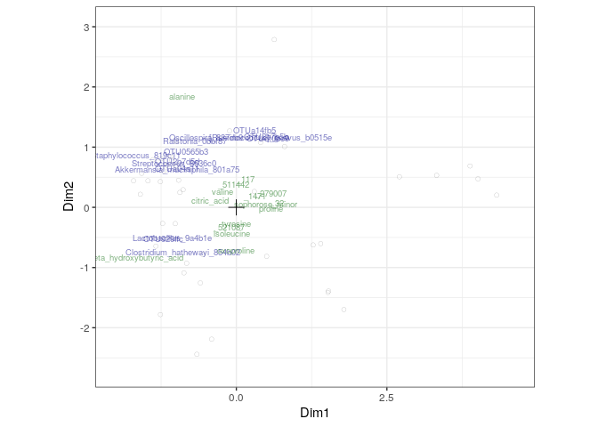
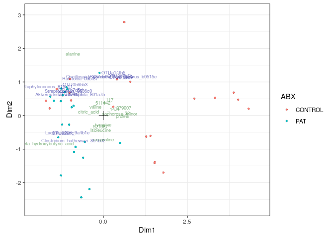
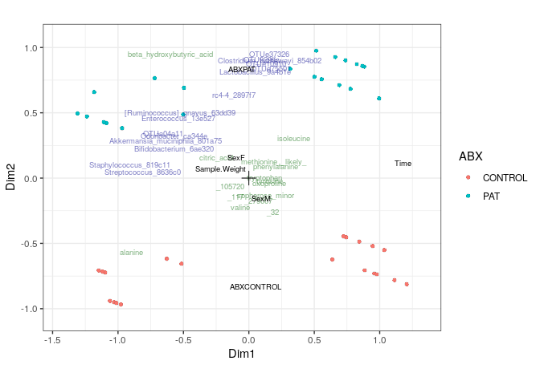
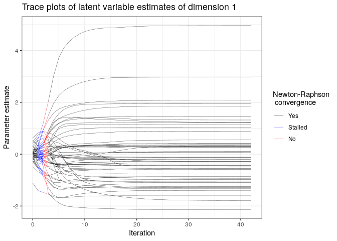
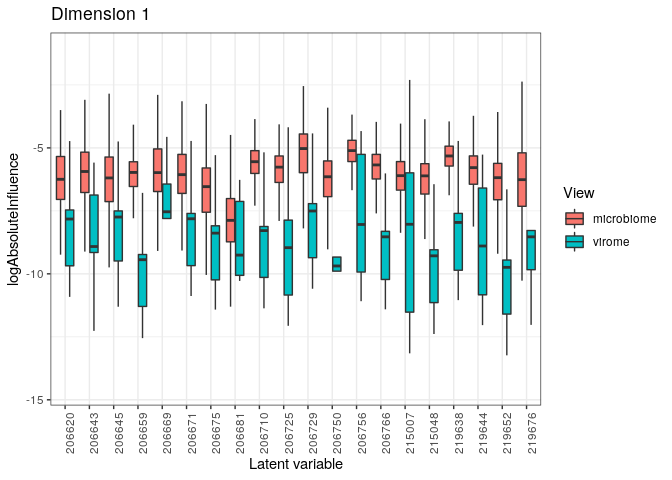

Manual for the use of the combi package
=======================================

Install and load packages
-------------------------

This repo contains R-code to fit and plot the mode-based integration models for compositional omics data. The basic usage is demonstrated here.

The package can be installed from BioConductor and loaded using the following commands:

``` r
library(BiocManager)
install("combi", update = FALSE)
```

``` r
suppressPackageStartupMessages(library(combi))
cat("combi package version", as.character(packageVersion("combi")), "\n")
```

    ## combi package version 0.1.0

Alternatively, the latest version can be installed directly from this GitHub repo as follows:

``` r
library(devtools)
install_github("CenterForStatistics-UGent/combi")
```

Unconstrained integration
-------------------------

For an unconstrained ordination, a named list of data matrices with overlapping samples must be supplied. In addition, information on the required distribution ("quasi" for quasi-likelihood fitting, "gaussian" for normal data) and compositional nature should be supplied.

``` r
data(Zhang)
microMetaboInt = combi(
 list("microbiome" = zhangMicrobio, "metabolomics" = zhangMetabo),
 distributions = c("quasi", "gaussian"), compositional = c(TRUE, FALSE),
 logTransformGaussian = FALSE)
```

A simple plot function is available for the result, for samples and shapes, a data frame should also be supplied

``` r
plot(microMetaboInt)
```



``` r
plot(microMetaboInt, samDf = zhangMetavars, samCol = "ABX")
```



Constrained integration
-----------------------

For a constrained ordination also a data frame of sample variables should be supplied

``` r
microMetaboIntConstr = combi(
     list("microbiome" = zhangMicrobio, "metabolomics" = zhangMetabo),
     distributions = c("quasi", "gaussian"), compositional = c(TRUE, FALSE),
     logTransformGaussian = FALSE, covariates = zhangMetavars)
```

    ## Warning in buildCovMat(covariates): Integer values treated as numeric!

``` r
plot(microMetaboIntConstr, samDf = zhangMetavars, samCol = "ABX")
```



Diagnostics
-----------

Convergence of the iterative algorithm can be assessed as follows:

``` r
convPlot(microMetaboInt)
```



Influence of the different views can be investigated through

``` r
inflPlot(microMetaboInt, samples = 1:20, plotType = "boxplot")
```


