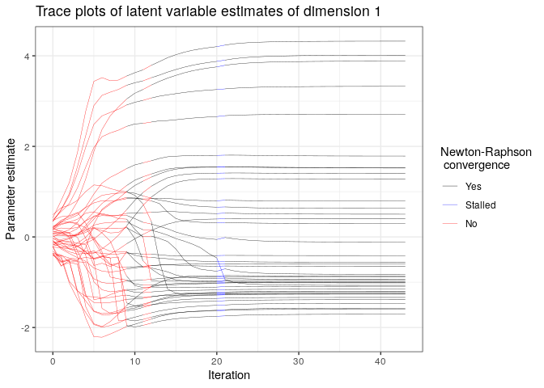
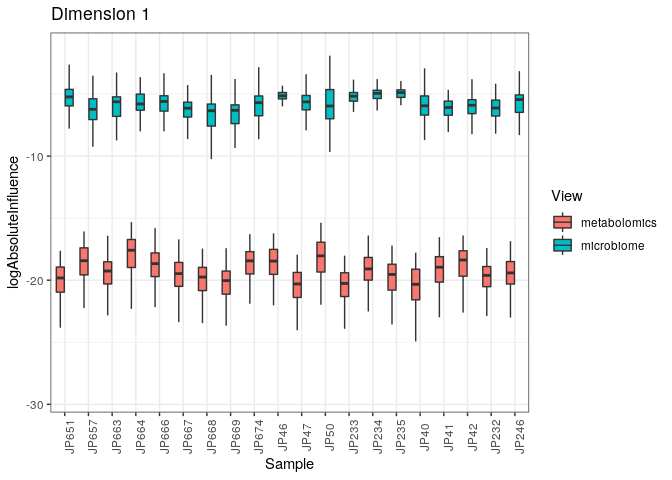

Manual for the use of the compIntegrate package
===============================================

Install and load packages
-------------------------

This repo contains R-code to fit and plot the mode-based integration models for compositional omics data. The basic usage is demonstrated here.

The package can be installed from BioConductor and loaded using the following commands:

``` r
library(BiocManager)
install("compIntegrate", update = FALSE)
```

``` r
suppressPackageStartupMessages(library(compIntegrate))
cat("compIntegrate package version", as.character(packageVersion("compIntegrate")), "\n")
```

    ## compIntegrate package version 0.1.0

Alternatively, the latest version can be installed directly from this GitHub repo as follows:

``` r
library(devtools)
install_github("CenterForStatistics-UGent/compIntegrate")
```

Unconstrained integration
-------------------------

For an unconstrained ordination, a named list of data matrices with overlapping samples must be supplied. In addition, information on the required distribution ("quasi" for quasi-likelihood fitting, "gaussian" for normal data) and compositional nature should be supplied.

``` r
data(hmp2)
microVirDI = compInt(data = list("microbiome" = microPruneVir,
"virome" = virPrune), 
distributions = c("quasi", "quasi"),
 compositional = c(TRUE, TRUE))
```

    ## Warning in compInt(data = list(microbiome = microPruneVir, virome = virPrune), : Zero rows
    ## 5 6 7 11 16 23 35 51 64 70
    ## filtered out prior to fit

    ## Zero rows
    ## 9 23 25 34
    ## filtered out after filtering features

A simple plot function is available for the result, for samples and shapes, a data frame should also be supplied

``` r
plot(microVirDI)
```


``` r
plot(microVirDI, samDf = hmp2samVar, samCol = "diagnosis")
```


Constrained integration
-----------------------

For a constrained ordination also a data frame of sample variables should be supplied

``` r
microVirDIconstr = compInt(data = list("microbiome" = microPruneVir,
 "virome" = virPrune), 
 distributions = c("quasi", "quasi"),
 compositional = c(TRUE, TRUE), 
 covariates = hmp2samVar[, c("diagnosis",
 "biopsy_location", "sex")])
```

    ## Warning in compInt(data = list(microbiome = microPruneVir, virome = virPrune), : Zero rows
    ## 5 6 7 11 16 23 35 51 64 70
    ## filtered out prior to fit

    ## Zero rows
    ## 9 23 25 34
    ## filtered out after filtering features

    ## Warning in buildCovMat(covariates): Factors with only one level dropped!

``` r
plot(microVirDIconstr, samDf = hmp2samVar, samCol = "diagnosis")
```


Diagnostics
-----------

Convergence of the iterative algorithm can be assessed as follows:

``` r
convPlot(microVirDI)
```



Influence of the different views can be investigated through

``` r
inflPlot(microVirDI, samples = 1:20, plotType = "boxplot")
```


